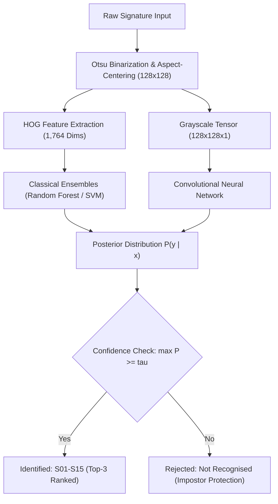
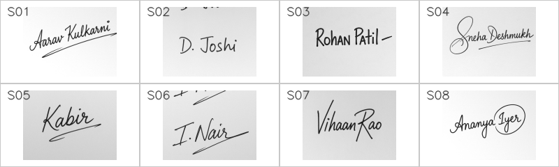

# SignID: Offline Signature Identification with Open-Set Impostor Rejection

## Abstract

Biometric signature identification in constrained environments faces two core challenges: limited training samples per identity and unconstrained document capture artifacts. This repository provides an end-to-end framework for closed-set signature identification across 15 enrolled identities ($S01$–$S15$) with open-set impostor rejection ($U01$–$U05$). Evaluating traditional feature-engineered pipelines against deep learning architectures under small-sample constraints (16 samples per identity), handcrafted Histogram of Oriented Gradients (HOG) combined with Random Forest and Linear SVM achieves 80.0% top-1 accuracy and 83.3% top-3 accuracy, significantly outperforming convolutional networks. A calibrated rejection threshold ($\tau = 0.44$) successfully rejects 88.9% of out-of-distribution impostor signatures.

---

## 1. Problem Formulation & Architecture

The objective couples $K$-class closed-set classification ($K=15$) with thresholded open-set verification:

$$\hat{y} = \begin{cases} \arg\max_{k \in \mathcal{Y}} P(y = k \mid I), & \text{if } \max_{k \in \mathcal{Y}} P(y = k \mid I) \ge \tau \\ \text{Not recognised}, & \text{otherwise} \end{cases}$$



---

## 2. Dataset & Canonical Preprocessing

The dataset contains physical signatures acquired on standardized grids with simulated real-world smartphone acquisition artifacts (perspective tilt, illumination gradients, Gaussian blur, sensor noise).



* **Enrolled Classes**: 15 identities ($S01$–$S15$), 16 samples each (240 total), stratified into 70% train, 10% validation, 20% test.
* **Unenrolled Impostors**: 5 identities ($U01$–$U05$, 36 test samples) reserved exclusively for open-set rejection calibration.
* **Preprocessing Pipeline**: Otsu binarization separates strokes from paper background; non-zero stroke bounding boxes are extracted and aspect-ratio centered into uniform $128 \times 128$ matrices with symmetric padding.
* **HOG Descriptor**: Extracted using $16 \times 16$ pixel cells, $2 \times 2$ cell blocks (L2-Hys normalization), and 9 orientation bins, yielding a 1,764-dimensional feature vector.

---

## 3. Empirical Benchmark Results

All classical models were tuned via 5-fold cross-validation grid search on the training set prior to evaluation on the held-out test split:

| Model Architecture | Feature Space | Test Accuracy | Top-3 Accuracy | Macro-F1 | Training Time |
| :--- | :--- | :---: | :---: | :---: | :---: |
| **HOG + Random Forest** | HOG (1,764 dims) | **80.0%** | **83.3%** | **76.30%** | 12.9s |
| **HOG + Linear SVM** | HOG (1,764 dims) | **80.0%** | **80.0%** | **74.96%** | 10.6s |
| **HOG + Logistic Regression** | HOG (1,764 dims) | 73.3% | 80.0% | 68.00% | 25.2s |
| **HOG + Gradient Boosting** | HOG (1,764 dims) | 73.3% | 73.3% | 66.22% | 165.9s |
| **HOG + K-Nearest Neighbors** | HOG (1,764 dims) | 70.0% | 73.3% | 62.52% | 1.5s |
| **Custom CNN (3 Blocks)** | Raw Grayscale (128x128) | 16.7% | 26.7% | 5.79% | 45.0s |

**Key Finding**: In small-sample regimes (~10 training instances per class), deep convolutional models suffer from severe overfitting due to unconstrained parameter capacity. In contrast, HOG injects a strong geometric inductive bias, allowing linear and tree ensemble boundaries to generalize reliably.

**Open-Set Calibration**: Calibrated threshold $\tau = 0.44$ achieves an **88.9% impostor rejection rate** on unknown signers ($U01$–$U05$) while preserving confident classifications on known signatures.

---

## 4. Application & Deployment

The system provides an asynchronous FastAPI backend paired with a modern React 19 + Vite dashboard featuring drag-and-drop inference, real-time threshold adjustment, and preprocessed stroke visualization.

### 4.1 Local Execution
```bash
# 1. Install dependencies
pip install -r requirements.txt

# 2. Run test suite
pytest tests

# 3. Launch application (serves API and React SPA on port 8000)
uvicorn app.api:app --reload --port 8000
```

### 4.2 Vercel Deployment

The frontend is configured for deployment on Vercel via [vercel.json](vercel.json):

1. **Import Repository**: Connect your GitHub repository to Vercel.
2. **Build Configuration**:
   * **Framework Preset**: Vite
   * **Build Command**: `cd app/frontend && npm install && npm run build`
   * **Output Directory**: `app/frontend/dist`
3. **Environment Variables**:
   * Add `VITE_API_URL` pointing to your hosted FastAPI backend (e.g., `https://your-api.railway.app` or `https://your-api.onrender.com`). If hosted on the same domain, leave empty.
4. **Deploy**: Deployments automatically route single-page application paths through `index.html`.

---

## 5. Pipeline Reproducibility

To re-execute data processing, training, and evaluation from scratch:

```bash
python -m src.crop_sheets        # Segment raw sheets into signature cells
python -m src.simulate_capture    # Apply perspective, blur, and lighting distortions
python -m src.auto_qc             # Automated bounding box quality check
python -m src.build_metadata      # Generate stratified splits (70/10/20)
python -m src.dataset             # Process into binary numpy tensors
python -m src.train_classical     # 5-fold grid search for SVM, RF, KNN, LR, GB
python -m src.evaluate            # Generate confusion matrices and calibrate tau
```

---

## 6. Academic Disclaimer

This project is developed solely for academic research and educational evaluation. The dataset and models evaluate closed-set biometric identification under controlled experimental conditions and must not be used for high-stakes financial, legal, or forensic verification without active multi-factor biometric protocols.
