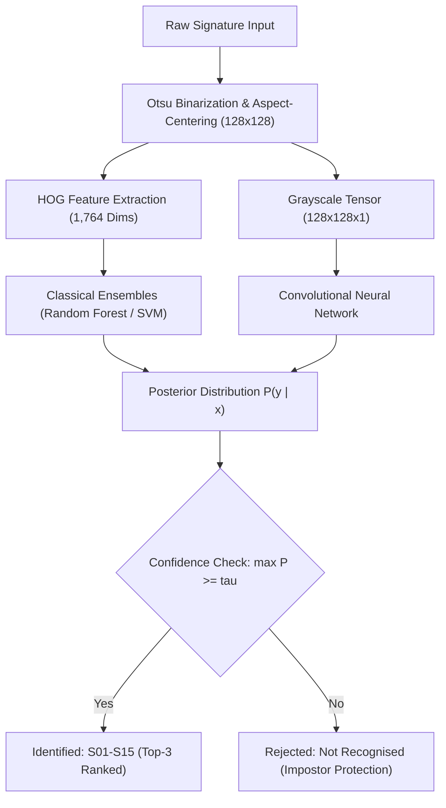

# SignID: Offline Signature Identification with Open-Set Impostor Rejection

## Abstract

Biometric signature identification in constrained environments faces two core challenges: limited training samples per identity and unconstrained document capture artifacts. This repository provides an end-to-end framework for closed-set signature identification across 15 enrolled identities (S01 to S15) with open-set impostor rejection (U01 to U05). Evaluating traditional feature-engineered pipelines against deep learning architectures under small-sample constraints (16 samples per identity), handcrafted Histogram of Oriented Gradients (HOG) combined with Random Forest and Linear SVM achieves 80.0% top-1 accuracy and 83.3% top-3 accuracy, significantly outperforming convolutional networks. A calibrated rejection threshold (tau = 0.44) successfully rejects 88.9% of out-of-distribution impostor signatures.

---

## 1. System Overview & Architecture

The identification engine handles two complementary tasks: identifying genuine signers among enrolled identities and rejecting unknown impostors. When a signature is provided, the model estimates confidence scores across all enrolled identities. If the top confidence score meets or exceeds a tuned decision threshold (tau), the identity is accepted; otherwise, the signature is rejected as "Not recognised".



---

## 2. Dataset & Canonical Preprocessing

The dataset contains physical signatures acquired on standardized grids with simulated real-world smartphone capture artifacts, including perspective tilt, illumination gradients, Gaussian blur, and additive sensor noise.


* **Enrolled Classes**: 15 identities (S01 to S15), 16 samples each (240 total), stratified into 70% train, 10% validation, and 20% test splits.
* **Unenrolled Impostors**: 5 identities (U01 to U05, 36 test samples) reserved strictly for open-set rejection calibration.
* **Preprocessing Pipeline**: Otsu thresholding separates ink strokes from the paper background. The non-zero stroke bounding box is cropped and centered inside a uniform 128x128 canvas, preserving the original stroke aspect ratio with symmetric margins.
* **HOG Descriptor**: Extracted using 16x16 pixel cells, 2x2 cell blocks with L2-Hys normalization, and 9 gradient orientation bins, producing a compact 1,764-dimensional feature vector.

---

## 3. Models Evaluated

We compared six distinct machine learning architectures to assess performance in small-sample settings:

* **HOG + Random Forest**:
  * *Description*: An ensemble of 100 decorrelated decision trees utilizing bootstrap aggregation and feature subspace sampling.
  * *How It Was Used*: Fitted on 1,764-dimensional HOG features with 5-fold cross-validation across tree depths and leaf sizes. Emerged as the top performer, delivering 80.0% accuracy, 83.3% top-3 accuracy, and well-calibrated class probabilities.
* **HOG + Linear Support Vector Machine (Linear SVM)**:
  * *Description*: A maximum-margin classifier constructing optimal linear decision boundaries between classes with balanced class weights.
  * *How It Was Used*: Applied to standard-scaled HOG vectors using Platt scaling to obtain calibrated posterior probabilities. Yielded 80.0% accuracy with fast inference (10.6s training time).
* **HOG + Logistic Regression**:
  * *Description*: A multinomial linear model applying the softmax function with L2 weight regularization.
  * *How It Was Used*: Trained on scaled HOG features with the L-BFGS optimizer. Reached 73.3% accuracy and 80.0% top-3 accuracy, confirming linear separability in the HOG feature space.
* **HOG + Gradient Boosting**:
  * *Description*: Sequential additive decision trees trained by minimizing multinomial deviance via gradient descent.
  * *How It Was Used*: Evaluated with learning rate shrinkage (0.1) on HOG vectors to test iterative residual correction against bagging ensembles. Achieved 73.3% accuracy.
* **HOG + K-Nearest Neighbors (KNN)**:
  * *Description*: A non-parametric distance-based classifier assigning labels based on the Euclidean majority among nearest neighbors.
  * *How It Was Used*: Tuned across neighborhood sizes (k = 3, 5, 7) on normalized HOG vectors as a simple geometric baseline (70.0% accuracy).
* **Convolutional Neural Network (CNN)**:
  * *Description*: A deep network featuring 3 convolutional blocks (Conv2D, Batch Normalization, ReLU, MaxPooling), Dropout (0.3), and a Dense softmax head (~260,000 parameters).
  * *How It Was Used*: Trained end-to-end on raw 128x128 grayscale signature images with data augmentation. Evaluated to measure deep learning behavior when training data is constrained.

---

## 4. Empirical Benchmark Results

All classical models were cross-validated on the training split before final evaluation on the isolated test set:

| Model Architecture | Feature Space | Test Accuracy | Top-3 Accuracy | Macro-F1 | Training Time |
| :--- | :--- | :---: | :---: | :---: | :---: |
| **HOG + Random Forest** | HOG (1,764 dims) | **80.0%** | **83.3%** | **76.30%** | 12.9s |
| **HOG + Linear SVM** | HOG (1,764 dims) | **80.0%** | **80.0%** | **74.96%** | 10.6s |
| **HOG + Logistic Regression** | HOG (1,764 dims) | 73.3% | 80.0% | 68.00% | 25.2s |
| **HOG + Gradient Boosting** | HOG (1,764 dims) | 73.3% | 73.3% | 66.22% | 165.9s |
| **HOG + K-Nearest Neighbors** | HOG (1,764 dims) | 70.0% | 73.3% | 62.52% | 1.5s |
| **Custom CNN (3 Blocks)** | Raw Grayscale (128x128) | 16.7% | 26.7% | 5.79% | 45.0s |

**Key Finding**: In low-sample regimes (10 training samples per identity), high-capacity deep CNNs overfit severely. Handcrafted HOG features introduce an effective geometric prior, enabling tree ensembles and linear margin classifiers to generalize with high fidelity.

**Open-Set Impostor Rejection**: Setting the rejection threshold tau to 0.44 achieves an **88.9% rejection rate** on out-of-distribution signers (U01 to U05) while accepting genuine signatures.

---

## 5. Application & Deployment

The system includes a FastAPI backend and a React 19 dashboard featuring single-image upload, preprocessed stroke inspection, real-time threshold tuning, and multi-model switching.

### 5.1 Local Execution
```bash
# 1. Install dependencies
pip install -r requirements.txt

# 2. Run test suite
pytest tests

# 3. Launch application (serves API and React SPA on port 8000)
uvicorn app.api:app --reload --port 8000
```

### 5.2 Vercel Deployment

The frontend includes pre-configured Vercel settings via [vercel.json](vercel.json):

1. **Import Repository**: Connect your GitHub repository to Vercel.
2. **Build Settings**:
   * **Framework Preset**: Vite
   * **Build Command**: `cd app/frontend && npm install && npm run build`
   * **Output Directory**: `app/frontend/dist`
3. **Backend Connection**:
   * Add the `VITE_API_URL` environment variable in Vercel pointing to your hosted FastAPI backend (such as Railway or Render). If served from the same domain, leave it empty.
4. **Deploy**: Client-side single-page routes are automatically handled by the pre-configured rewrites.

---

## 6. Pipeline Reproducibility

To re-run data extraction, training, and evaluation:

```bash
python -m src.crop_sheets        # Segment raw sheets into signature cells
python -m src.simulate_capture    # Apply perspective, blur, and lighting distortions
python -m src.auto_qc             # Automated bounding box quality check
python -m src.build_metadata      # Generate stratified splits (70/10/20)
python -m src.dataset             # Process into binary numpy tensors
python -m src.train_classical     # 5-fold grid search for SVM, RF, KNN, LR, GB
python -m src.evaluate            # Generate confusion matrices and calibrate tau
```

---

## 7. Academic Disclaimer

This project is developed for academic research and educational evaluation. The models evaluate closed-set biometric identification under controlled experimental conditions and are not intended for high-stakes legal or financial verification without multi-factor biometric systems.
