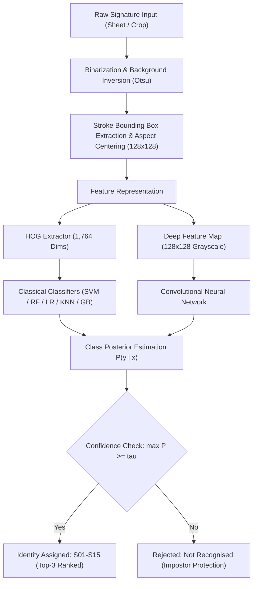

# SignID: Offline Signature Identification with Open-Set Impostor Rejection Under Low-Sample Regimes

## Abstract

Biometric signature identification presents distinct machine learning challenges when deployed in practical, low-resource settings characterized by constrained sample sizes per identity and unconstrained document capture artifacts. This repository provides an end-to-end framework for closed-set signature identification across 15 enrolled identities ($S01$–$S15$) coupled with open-set rejection for unseen impostor identities ($U01$–$U05$). We evaluate traditional feature-engineered pipelines against deep learning architectures under realistic small-sample constraints (16 samples per enrolled identity). Empirical results demonstrate that handcrafted Histogram of Oriented Gradients (HOG) combined with ensemble and margin-based classifiers significantly outperforms end-to-end convolutional neural networks, achieving 80.0% top-1 accuracy and 83.3% top-3 accuracy on held-out test data. Furthermore, a calibrated posterior thresholding mechanism ($\tau = 0.44$) successfully rejects 88.9% of out-of-distribution impostor signatures without catastrophic degradation of known identity acceptance.

---

## 1. Problem Formulation

The objective is formulated as a hybrid biometric task combining $K$-class closed-set classification with open-set verification:

1. **Closed-Set Identification**: Given a signature image $I \in \mathbb{R}^{H \times W}$, map $I$ to one of $K = 15$ known identities $\mathcal{Y} = \{S01, S02, \dots, S15\}$.
2. **Open-Set Impostor Rejection**: If an input signature originates from an unenrolled identity $u \notin \mathcal{Y}$ (e.g., $U01$–$U05$), the system must abstain from forced classification and output $\text{"Not recognised"}$.

The decision rule is parameterized by a rejection threshold $\tau \in [0, 1]$ applied to the posterior probability distribution $P(y = k \mid I)$:

$$\hat{y} = \begin{cases} \arg\max_{k \in \mathcal{Y}} P(y = k \mid I), & \text{if } \max_{k \in \mathcal{Y}} P(y = k \mid I) \ge \tau \\ \text{Not recognised}, & \text{otherwise} \end{cases}$$

---

## 2. Dataset and Realistic Capture Simulation

The dataset comprises physical signature sheets acquired on standardized paper grids, supplemented with simulated real-world acquisition distortions.


### 2.1 Dataset Composition
* **Enrolled Classes**: 15 distinct identities ($S01$–$S15$), each contributing 16 physical signatures segmented across a 4x3 sheet grid (240 total samples).
* **Unknown Impostor Classes**: 5 distinct identities ($U01$–$U05$) reserved strictly for open-set validation and false-acceptance rate testing (36 test samples).
* **Data Splits**: Partitioned using stratified sampling into:
  * Training: 10 samples per identity (66.7%, 150 samples)
  * Validation: 2 samples per identity (13.3%, 30 samples)
  * Test: 4 samples per identity (20.0%, 60 samples)

### 2.2 Physical to Digital Ingestion Pipeline
1. **Grid Segmentation**: High-resolution scanned sheets are segmented into localized bounding boxes corresponding to individual cells using adaptive thresholding and horizontal/vertical projection profiles.
2. **Environmental Simulation**: Raw crops undergo synthetic smartphone camera artifact generation:
   * Perspective transformation (projective tilt $\pm 4^{\circ}$)
   * Non-uniform illumination gradients (simulating directional shadows)
   * Gaussian blur ($\sigma \in [0.5, 1.2]$)
   * Additive sensor noise (Gaussian $\mathcal{N}(0, \sigma^2)$)
3. **Automated Quality Control**: Bounding box aspect ratios and stroke density metrics are verified to reject empty cells or clipping anomalies.

---

## 3. End-to-End System Architecture

The complete processing, feature extraction, and inference pipeline is organized as follows:



---

## 4. Preprocessing and Feature Engineering

### 4.1 Canonical Normalization
Input signatures exhibit significant variation in ink contrast, stroke thickness, and positioning. Preprocessing standardizes each input:
* **Otsu Binarization**: Computes optimal global threshold separating stroke pixels from paper background.
* **Stroke Isolation**: Background is set to 0 and foreground stroke to 1.
* **Aspect-Preserving Centering**: The minimal bounding box containing all non-zero pixels is extracted and scaled into a uniform $128 \times 128$ pixel matrix, maintaining stroke geometry with symmetric padding.

### 4.2 Histogram of Oriented Gradients (HOG)
Local gradient orientations capture edge transitions and curvature characteristic of handwriting:
* Window size: $128 \times 128$
* Pixels per cell: $16 \times 16$
* Cells per block: $2 \times 2$ (with L2-Hys block normalization)
* Gradient orientation bins: 9 bins ($0^{\circ}$ to $180^{\circ}$)
* Total descriptor dimensionality: 1,764 dimensions

---

## 5. Experimental Results and Comparative Analysis

### 5.1 Model Benchmark on Held-Out Test Set

All classical classifiers underwent 5-fold cross-validated grid search on the training split before final evaluation on the isolated test set:

| Model Architecture | Feature Representation | Test Accuracy | Top-3 Accuracy | Test Macro-F1 | Training Time (s) |
| :--- | :--- | :---: | :---: | :---: | :---: |
| **HOG + Random Forest** | Handcrafted HOG (1,764 dims) | **80.0%** | **83.3%** | **76.30%** | 12.9 |
| **HOG + Linear SVM** | Handcrafted HOG (1,764 dims) | **80.0%** | **80.0%** | **74.96%** | 10.6 |
| **HOG + Logistic Regression** | Handcrafted HOG (1,764 dims) | 73.3% | 80.0% | 68.00% | 25.2 |
| **HOG + Gradient Boosting** | Handcrafted HOG (1,764 dims) | 73.3% | 73.3% | 66.22% | 165.9 |
| **HOG + K-Nearest Neighbors** | Handcrafted HOG (1,764 dims) | 70.0% | 73.3% | 62.52% | 1.5 |
| **Custom CNN (3 Blocks)** | End-to-end 128x128 pixels | 16.7% | 26.7% | 5.79% | 45.0 |

### 5.2 Discussion: Inductive Bias in Low-Sample Regimes
A critical finding is the stark performance disparity between handcrafted feature pipelines (70.0%–80.0%) and the end-to-end CNN (16.7%). Deep convolutional architectures possess high parameter capacity (~260k parameters) requiring tens of thousands of varied training instances to escape catastrophic overfitting. With 10 training instances per class, gradient descent converges to non-generalizable stroke artifacts. In contrast, HOG injects a strong geometric inductive bias (local edge orientation histograms), transforming the task into a linearly separable space where maximum-margin hyperplanes (Linear SVM) and orthogonal feature subsampling (Random Forest) generalize robustly.

---

## 6. Open-Set Impostor Rejection Analysis

To prevent forced misclassification when confronted with unenrolled individuals, the decision threshold $\tau$ was calibrated against unseen identities $U01$–$U05$.

* **Optimal Calibrated Threshold**: $\tau = 0.44$
* **Impostor Rejection Rate**: **88.9%** (32 of 36 unknown test signatures correctly rejected)
* **Known Identity Preservation**: 73.3% of genuine test samples exceed $\tau$ and are identified with high certainty. Samples falling below $\tau$ represent ambiguous stroke extractions flagged for human verification.

Confusion matrices, training loss histories, and rejection trade-off curves are preserved in `reports/figures/`.

---

## 7. Interactive System and API

The repository provides a modular, production-ready inference stack:

### 7.1 Backend (FastAPI)
The backend exposes asynchronous endpoints for health, model metadata, sample retrieval, and multi-model inference:
* `GET /api/health`: Service status and model directory verification.
* `GET /api/models`: Returns list of available trained models and default $\tau$.
* `GET /api/samples`: Preloaded test crops for quick verification.
* `POST /api/predict`: Multipart form upload handling image decoding, canonical preprocessing, forward inference, top-3 ranked distribution, and latency profiling.

### 7.2 Frontend (React 19 + Vite)
A modern client interface located in `app/frontend`:
* Live signature upload and canvas drag-and-drop.
* Model selector supporting dynamic switching between Random Forest, Linear SVM, and CNN.
* Interactive threshold slider ($\tau$) with real-time feedback on rejection status.
* Side-by-side inspection of raw input versus preprocessed $128 \times 128$ normalized stroke canvas.
* Static SPA served directly from FastAPI or via the Vite development server.

---

## 8. Directory Structure

```
.
|-- app/
|   |-- api.py                  # FastAPI server and static SPA mount
|   `-- frontend/               # React 19 + Vite user interface
|       |-- dist/               # Compiled production assets
|       `-- src/                # UI components and styling
|-- data/
|   `-- processed/              # Normalized binary tensors (X.npy, y.npy)
|-- dataset/
|   |-- identities.csv          # Metadata registry for enrolled signers
|   `-- metadata.csv            # Segmentation coordinates, splits, and QC flags
|-- docs/
|   `-- signature_samples.png   # Sample signature collage
|-- models/
|   |-- best_classical.joblib   # Serialized Random Forest model
|   |-- svm.joblib              # Serialized Linear SVM model
|   |-- class_map.json          # Label index mapping (0 -> S01)
|   |-- classical_results.json  # Comprehensive cross-validation metrics
|   |-- cnn.weights.h5          # Trained CNN weights
|   |-- cnn_history.json        # Neural training progression log
|   `-- threshold.json          # Calibrated rejection cutoff
|-- reports/
|   |-- metrics.json            # Final test evaluation metrics
|   `-- figures/                # Confusion matrices and reject curves
|-- src/
|   |-- auto_qc.py              # Quality control bounding verification
|   |-- build_metadata.py       # Stratified metadata generator
|   |-- config.py               # Central project parameters and paths
|   |-- crop_sheets.py          # Adaptive grid cell segmentation
|   |-- dataset.py              # Array loading and pipeline orchestration
|   |-- evaluate.py             # Evaluation routines and curve generation
|   |-- features.py             # HOG descriptor extraction
|   |-- models.py               # Deep neural architecture definitions
|   |-- predict.py              # Standalone inference engine
|   |-- preprocess.py           # Otsu binarization and bounding box centering
|   |-- simulate_capture.py     # Camera artifact and distortion generator
|   |-- train_classical.py      # Grid search across 5 classical models
|   `-- train_cnn.py            # CNN training with early stopping
|-- tests/                      # Pytest unit testing suite
|-- pytest.ini
|-- requirements.txt
`-- README.md
```

---

## 9. Reproducibility and Execution

### 9.1 Environment Setup
Create a clean virtual environment and install dependencies:

```bash
python -m venv .venv
source .venv/bin/activate  # On Windows: .venv\Scripts\activate
pip install -r requirements.txt
```

### 9.2 Running Unit Tests
Execute the full test suite covering preprocessing, feature extraction, neural models, and API endpoints:

```bash
pytest tests
```

### 9.3 End-to-End Pipeline Execution

1. **Segment Raw Scanned Sheets into Cell Crops**:
   ```bash
   python -m src.crop_sheets
   ```

2. **Simulate Realistic Environmental Capture**:
   ```bash
   python -m src.simulate_capture
   ```

3. **Verify Quality Control & Build Stratified Splits**:
   ```bash
   python -m src.auto_qc
   python -m src.build_metadata
   python -m src.dataset
   ```

4. **Train Classifiers**:
   ```bash
   # Train all traditional machine learning models (SVM, RF, KNN, LR, GB)
   python -m src.train_classical

   # Train benchmark Convolutional Neural Network
   python -m src.train_cnn
   ```

5. **Evaluate Models and Calibrate Threshold**:
   ```bash
   python -m src.evaluate
   ```

### 9.4 Launching the Application
Launch the unified FastAPI server:

```bash
uvicorn app.api:app --reload --port 8000
```

Navigate to `http://localhost:8000` in any modern web browser to access the interactive identification dashboard.

---

## 10. License and Academic Disclaimer

This project is developed strictly for academic research and educational demonstration. The dataset and models evaluate closed-set biometric identification under controlled experimental conditions; they must not be employed for high-stakes financial, legal, or forensic verification without cryptographic liveness detection and active multi-factor biometric protocols.
